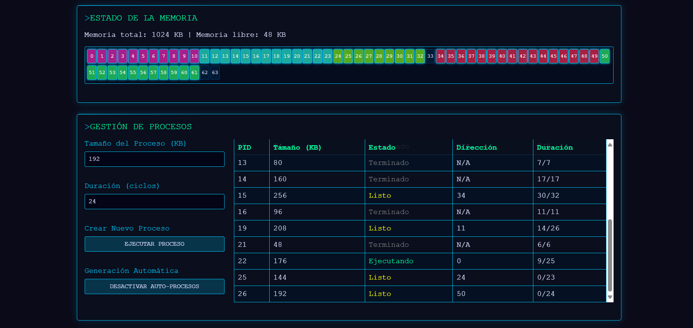

# 🧠 Simulador de Gestión de Memoria en Sistemas Operativos

Este proyecto es una simulación interactiva de la gestión de memoria en un sistema operativo, diseñada para visualizar cómo se asigna, ejecuta y libera la memoria de procesos en tiempo real. Ideal para fines educativos, demostraciones técnicas o análisis de algoritmos de asignación.

---

## 🚀 Características principales

- **Asignación de memoria dinámica** con algoritmos:
  - First Fit
  - Best Fit
  - Worst Fit
- **Bloques de memoria visuales**, con color por PID y estado (libre/ocupado).
- **Procesos simulados** con duración, tamaño, estado y dirección de memoria.
- **Planificación Round-Robin** con quantum configurable.
- **Simulación de bloqueo por I/O**, desbloqueo automático y cambio de contexto.
- **Generación automática de procesos**, con parámetros aleatorios realistas.
- **Compactación de memoria** para reducir fragmentación externa.
- **Visualización en tiempo real** de:
  - Mapa de memoria
  - Tabla de procesos
  - Log del sistema
  - Métricas de memoria libre/total
- **Interfaz interactiva** con controles para:
  - Iniciar simulación
  - Agregar procesos manualmente
  - Activar/desactivar generación automática
  - Cambiar algoritmo de asignación
  - Ajustar velocidad de ejecución

---

## Screenshot

---

## 📦 Estructura del sistema

- `config`: configuración global del sistema (memoria, velocidad, algoritmos, procesos).
- `scheduler`: planificador de procesos con cola de listos y proceso en ejecución.
- `memory`: array de bloques que representa la memoria física.
- `processes`: lista de PCBs con atributos como PID, tamaño, duración, estado, dirección.
- `clock`: reloj del sistema que avanza por ticks simulados.

---

## 🧮 Estados de proceso

- `new`: recién creado
- `ready`: listo para ejecutar
- `running`: en ejecución
- `blocked`: esperando por I/O
- `terminated`: finalizado y con memoria liberada

---

## 🧪 Algoritmos de asignación

- **First Fit**: asigna al primer hueco contiguo disponible.
- **Best Fit**: asigna al hueco más pequeño que sea suficiente.
- **Worst Fit**: asigna al hueco más grande disponible.

---

## 🧰 Controles disponibles

| Control                  | Descripción |
|--------------------------|-------------|
| `Tamaño de memoria`      | Define el total de memoria disponible (KB). |
| `Algoritmo de asignación`| Selecciona el algoritmo de asignación. |
| `Velocidad de ejecución` | Ajusta los ticks por segundo. |
| `Agregar proceso`        | Crea un proceso con tamaño y duración definidos. |
| `Auto-procesos`          | Activa generación automática de procesos. |
| `Iniciar simulación`     | Reinicia el sistema y limpia memoria/procesos. |

---

## 📊 Visualización

- **Mapa de memoria**: bloques coloreados por PID, con tooltip por dirección.
- **Tabla de procesos**: muestra PID, tamaño, estado, dirección y progreso.
- **Log del sistema**: eventos importantes como creación, terminación, bloqueo, compactación.
- **Métricas**: memoria total y libre actualizada en tiempo real.

---

## 🧠 Lógica avanzada

- Compactación automática si no hay hueco contiguo suficiente.
- Simulación de bloqueo por I/O con desbloqueo por tiempo.
- Cambio de contexto con coste configurable.
- Quantum configurable para planificación Round-Robin.
- PID único por proceso, usado para colorear bloques y rastrear asignación.

---

## 📌 Requisitos

Este script está diseñado para ejecutarse en un entorno web moderno con soporte para JavaScript y DOM. No requiere librerías externas.

---

## 🧑‍💻 Autor

Desarrollado por Dev, con enfoque en simulación educativa, visualización técnica y análisis de algoritmos de sistemas operativos.